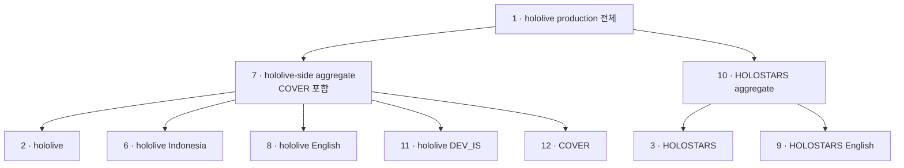
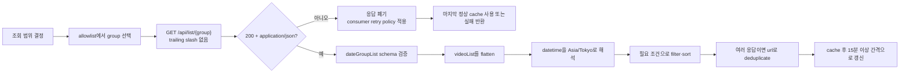

# Observed API: `schedule.hololive.tv`

## 상태와 범위

`schedule.hololive.tv`가 공개적으로 노출하는 미문서 JSON API의 관찰 기반 명세입니다. COVER가 게시한 공식 API 문서는 확인되지 않았고 versioned contract도 아니므로, endpoint와 schema는 사전 통지 없이 바뀔 수 있습니다.

- Base URL: `https://schedule.hololive.tv`
- Last verified: `2026-08-13` KST
- 확인된 JSON route family: `GET /api/list[/{group}]`
- `GET /api` 자체는 JSON index가 아니며 `404 text/html`을 반환합니다.
- 인증 정보 없이 읽을 수 있었지만, 이를 장기적인 무인증 제공 보장으로 해석하지 않습니다.

현재 저장소는 이 JSON API를 소비하지 않습니다. `hololive/hololive-shared/pkg/service/holodex/provider/htmlscraper/official_schedule_fetcher.go`가 fallback으로 `GET /lives/hololive` HTML을 읽습니다. JSON API 채택은 별도의 구현·계약 변경으로 다뤄야 합니다.

## 전체 사용법 맵

### Group 선택 구조

아래 연결선은 현재 응답의 URL 집합 기준 aggregate 관계입니다. API 응답 JSON이 이 계층으로 중첩된다는 뜻은 아닙니다.



호출 목적에 맞는 가장 작은 endpoint 하나를 우선 사용합니다.

| 목적 | Endpoint | 소비 방법 |
|---|---|---|
| 전체 일정 | `/api/list/1` | 명시적인 전체 selector로 권장 |
| hololive-side aggregate | `/api/list/7` | group `2`, `6`, `8`, `11`, `12`; `COVER` 일정도 포함됨 |
| HOLOSTARS 전체 | `/api/list/10` | group `3`과 English를 함께 반환 |
| hololive / HOLOSTARS | `/api/list/2`, `/api/list/3` | 각 기본 branch만 필요할 때 사용 |
| Indonesia / English / HOLOSTARS English | `/api/list/6`, `/api/list/8`, `/api/list/9` | 원하는 해외 branch 하나만 조회 |
| DEV_IS / COVER | `/api/list/11`, `/api/list/12` | 해당 분류만 조회 |
| 임의 조합 | 필요한 direct group 여러 개 | client에서 `url` 기준 merge·deduplicate |
| 날짜·talent·live 여부로 검색 | 가장 가까운 group 하나 | 별도 server-side filter가 없으므로 client-side filter |
| 장기 이력 | 확인된 history endpoint/query 없음 | 응답을 별도 저장하거나 다른 history source 사용 |

`4`, `5`, `0`, omitted selector, 미등록 selector는 새 consumer의 선택지로 사용하지 않습니다. 지원 allowlist는 현재 `1`, `2`, `3`, `6`, `7`, `8`, `9`, `10`, `11`, `12`입니다.

### 요청 계약 요약

| 항목 | 사용법 |
|---|---|
| Base URL | `https://schedule.hololive.tv` |
| Method | body 없는 simple `GET` |
| Path input | `/api/list/{group}`의 allowlisted `group` 하나 |
| Query / pagination | 확인된 parameter 없음 |
| Auth / cookie | 현재 불필요. 응답이 설정하는 session/XSRF cookie도 다음 요청에 불필요 |
| Request header | `Accept: application/json` 정도만 사용하고 preflight 유발 header는 피함 |
| Success | `200`이면서 `Content-Type`이 `application/json`이고 `dateGroupList`가 배열 |
| Time window | 확인 시점에는 전일·당일·익일 세 date group. 고정 계약으로 가정하지 않음 |
| Timezone | offset 없는 `Asia/Tokyo` 기준 문자열로 해석 |
| Refresh | 사이트 전체 일정의 15분 갱신 안내를 polling floor로 사용 |

### Client 처리 흐름



최소 호출 예시는 다음과 같습니다.

```bash
curl -fsS --compressed \
  -H 'Accept: application/json' \
  https://schedule.hololive.tv/api/list/7 |
  jq '[
    .dateGroupList[].videoList[] |
    {datetime, isLive, url, title, name}
  ]'
```

응답 탐색 경로는 다음과 같습니다.

```text
response
└── dateGroupList[]
    ├── displayDate
    ├── datetime
    └── videoList[]
        ├── datetime / isLive / platformType
        ├── url / thumbnail / title / name
        ├── talent
        │   └── name / iconImageUrl
        └── collaboTalents[]
            └── name / iconImageUrl
```

### Consumer 안전 규칙

| 경계 | 위험 | 필수 처리 |
|---|---|---|
| Group 입력 | 미등록 값도 전체 일정 `200`으로 fallback | 정수 변환만 믿지 말고 group allowlist 적용 |
| URL | trailing slash가 HTTP downgrade redirect를 유발 | `https://schedule.hololive.tv/api/list/{group}` 형태 고정 |
| HTTP 응답 | HTML 오류 페이지도 반환 가능 | `200`과 `Content-Type: application/json`을 함께 검증 |
| JSON schema | 미문서 API라 field가 추가·누락될 수 있음 | unknown field 허용, 필요한 container/type는 검증 |
| 빈 목록 | 정상적으로 일정이 없을 수 있음 | 빈 `videoList`를 transport/schema 오류와 구분 |
| 시간 | offset 없는 문자열 | 실행 환경의 local timezone 대신 `Asia/Tokyo`로 명시 해석 |
| 복수 group | 같은 방송이 중복될 수 있음 | `url`을 현재의 deduplication key로 사용 |
| Identity | stable talent/channel ID가 없고 `name`은 표시명 | `name`이나 `platformType`을 영속 key로 쓰지 않고 consumer-owned member mapping을 별도 유지 |
| `isLive` | field별 freshness timestamp가 없음 | 실시간 truth나 초 단위 전환 신호로 사용하지 않음 |
| Polling | 공식 rate-limit contract가 없음 | 15분보다 짧은 정기 polling을 기본값으로 두지 않음 |
| Browser CORS | simple `GET`은 가능하지만 preflight는 `403` | custom header를 피하고 단순 `GET` 유지 |
| 장애·drift | freshness marker와 version field가 없음 | 마지막 정상 cache, 오류 metric, schema-drift 관찰을 consumer가 소유 |

### 저장소에서 client를 구현할 때

이 절은 upstream contract가 아니라 이 저장소에 도입할 경우의 구현 권고입니다.

- `context.Context`를 첫 인자로 받고 `http.NewRequestWithContext`로 취소를 전달합니다.
- `httputil.NewExternalAPIClient(settings.DefaultOfficialScheduleConfig().Timeout)`을 사용합니다. 현재 기본 timeout은 15초입니다.
- response body는 항상 닫고, `httputil.ReadAllLimited`와 `settings.DefaultMaxResponseBodyBytes`의 현재 2MiB 한도로 읽습니다.
- transport error와 일시적 `5xx`만 bounded retry 대상으로 두고, `429`가 새로 관찰되면 `Retry-After`를 존중하거나 호출을 실패시킵니다. `4xx`, content-type mismatch, schema drift는 같은 payload를 즉시 반복하지 않습니다.
- `name`을 저장소 member identity로 직접 쓰지 않고, 기존 member data가 소유하는 alias/name-to-channel mapping을 통해 해석합니다.

## Endpoint inventory

| Method | Path | Result | Notes |
|---|---|---|---|
| `GET` | `/api/list` | `200 application/json` | 전체 일정. `/api/list/1`과 같은 URL 집합이 관찰됨 |
| `GET` | `/api/list/{group}` | `200 application/json` | 아래 allowlist의 group으로 일정을 필터링 |
| `HEAD` | `/api/list[/{group}]` | `200 application/json` | body 없이 동일 route metadata 반환 |
| `OPTIONS` | `/api/list[/{group}]` | `403 text/html` | CloudFront에서 거부됨. preflight가 필요한 브라우저 요청에는 의존하지 않음 |

별도 query parameter는 발견되지 않았습니다. `group`은 query가 아니라 optional path segment입니다.

canonical path에는 trailing slash를 붙이지 않습니다. `/api/list/1/`은 `http://schedule.hololive.tv/api/list/1`로 `301`한 뒤 다시 HTTPS로 `301`되어 불필요한 downgrade redirect 두 번을 거쳤습니다.

## Group selector

공개 HTML 분류 페이지의 일정 방송 카드(`a.thumbnail` 중 `movieClick` 대상) URL 집합과 API의 `dateGroupList[].videoList[].url` 집합을 비교했습니다. 프로모션 카드는 제외했습니다. 직접 분류는 두 집합이 일치했고, aggregate는 구성 group의 합집합과 일치했습니다.

| Group | 관찰된 의미 | 검증 근거 | 사용 판단 |
|---:|---|---|---|
| omitted | 전체 | `1`과 동일 | 호환 동작만 관찰; 신규 사용 비권장 |
| `0` | 전체와 동일 | `1`과 동일한 fallback 결과 | 사용하지 말고 `1` 사용 |
| `1` | hololive production 전체 | [`/lives/all`](https://schedule.hololive.tv/lives/all) 및 `7 ∪ 10`과 일치 | 권장 |
| `2` | hololive | [`/lives/hololive`](https://schedule.hololive.tv/lives/hololive)와 일치 | 사용 가능 |
| `3` | HOLOSTARS | [`/lives/holostars`](https://schedule.hololive.tv/lives/holostars)와 일치 | 사용 가능 |
| `4` | INNK legacy로 추정 | 과거 메뉴/주변 ID 순서상 후보. [`/lives/innk`](https://schedule.hololive.tv/lives/innk)와 API 모두 현재 비어 있음 | 미확정이므로 사용하지 않음 |
| `5` | hololive China legacy로 추정 | 과거 메뉴/주변 ID 순서상 후보. [`/lives/china`](https://schedule.hololive.tv/lives/china)와 API 모두 현재 비어 있음 | 미확정이므로 사용하지 않음 |
| `6` | hololive Indonesia | [`/lives/indonesia`](https://schedule.hololive.tv/lives/indonesia)와 일치 | 사용 가능 |
| `7` | hololive-side aggregate | `2 ∪ 6 ∪ 8 ∪ 11 ∪ 12`와 일치 | 구성에 `COVER`가 포함됨에 유의 |
| `8` | hololive English | [`/lives/english`](https://schedule.hololive.tv/lives/english)와 일치 | 사용 가능 |
| `9` | HOLOSTARS English | [`/lives/holostars_english`](https://schedule.hololive.tv/lives/holostars_english)와 일치 | 사용 가능 |
| `10` | HOLOSTARS aggregate | `3 ∪ 9`와 일치 | 사용 가능 |
| `11` | hololive DEV_IS | [`/lives/dev_is`](https://schedule.hololive.tv/lives/dev_is)와 일치 | 사용 가능 |
| `12` | COVER | [`/lives/cover`](https://schedule.hololive.tv/lives/cover)와 일치 | 사용 가능 |

미등록 selector `13`, `99`, `abc`, `-1`은 모두 `404`가 아니라 전체 일정과 같은 `200` 응답을 반환했습니다. 따라서 입력을 그대로 path에 넣지 말고, 소비자가 지원하는 group을 명시적으로 allowlist해야 합니다.

`4`, `5`의 이름은 [2020년 보관 메뉴](https://web.archive.org/web/20200801184934id_/https://schedule.hololive.tv/lives)의 `전체 → ホロライブ → ホロスターズ → イノナカ → China → Indonesia` 순서와 [공개 consumer가 직접 매핑한](https://github.com/scott1991/node-holo-ics/blob/8716125eaa9bba4ab60760efa3da25874f48bfd5/config.json) 주변 ID `2`, `3`, `6`에서 추론했습니다. ID와 이름을 직접 연결하는 코드나 비어 있지 않은 보관 API 응답은 발견하지 못했으므로 확정 매핑이 아닙니다.

## Response shape

모든 확인된 group은 같은 top-level schema를 사용했습니다. 다음 예시는 변동하는 방송 정보를 placeholder로 축약했습니다.

```json
{
  "dateGroupList": [
    {
      "displayDate": "08.13",
      "datetime": "2026/08/13 00:00:00",
      "videoList": [
        {
          "displayDate": "09:00",
          "datetime": "2026/08/13 09:00:12",
          "isLive": false,
          "platformType": 1,
          "url": "https://www.youtube.com/watch?v=...",
          "thumbnail": "https://img.youtube.com/vi/.../mqdefault.jpg",
          "title": "...",
          "name": "...",
          "talent": {
            "name": "...",
            "iconImageUrl": "https://..."
          },
          "collaboTalents": [
            {
              "name": "...",
              "iconImageUrl": "https://..."
            }
          ]
        }
      ]
    }
  ]
}
```

### Fields

| Path | Observed type | Meaning / caveat |
|---|---|---|
| `dateGroupList` | `array<object>` | 확인 시점에는 전일·당일·익일 세 묶음이 반환됨. 고정 cardinality 계약은 없음 |
| `dateGroupList[].displayDate` | `string` | `MM.DD` 표시용 날짜 |
| `dateGroupList[].datetime` | `string` | `YYYY/MM/DD HH:mm:ss`; timezone offset이 없는 provider-local 날짜 |
| `dateGroupList[].videoList` | `array<object>` | 해당 날짜의 일정. 일정이 없으면 빈 배열 |
| `videoList[].displayDate` | `string` | `HH:mm` 표시용 시각 |
| `videoList[].datetime` | `string` | `YYYY/MM/DD HH:mm:ss`; 초가 `00`이라는 보장은 없음 |
| `videoList[].isLive` | `boolean` | provider가 판단한 현재 live 여부 |
| `videoList[].platformType` | `number` | provider-owned 분류값. 현재는 `1`만, [2021년 보관 응답](https://web.archive.org/web/20210831020928id_/https://schedule.hololive.tv/api/list)의 non-YouTube radio 항목에서는 `0`이 관찰됨. 공식 enum 의미는 미확인 |
| `videoList[].url` | `string` | 방송 URL |
| `videoList[].thumbnail` | `string` | thumbnail URL |
| `videoList[].title` | `string` | 방송 제목 |
| `videoList[].name` | `string` | 대표 talent/channel 표시명 |
| `videoList[].talent` | `object` | 대표 talent의 `name`, `iconImageUrl` |
| `videoList[].collaboTalents` | `array<object>` | 공동 출연 talent 목록. 없으면 빈 배열 |

현재 응답에서는 위 필드가 일관되게 존재했고 `null`이나 빈 문자열은 없었습니다. 2021년 보관 응답에는 빈 `title`이 있었고 `talent`, `collaboTalents[]`에 `name` 없이 `iconImageUrl`만 있는 항목도 있었습니다. 따라서 현재의 nested `name` 존재 여부와 문자열의 non-empty를 계약으로 삼지 않습니다. 미문서 API이므로 consumer는 unknown field를 허용하고, required/nullability drift를 오류로 관찰할 수 있어야 합니다.

## 시간대와 갱신

- timestamp에는 offset이나 timezone 이름이 없습니다.
- API 결과는 기본 HTML 페이지의 `Asia/Tokyo` 일정과 일치했습니다.
- `timezone=UTC`, `Asia/Seoul`, `America/New_York`, `Europe/London`, `Tokyo` cookie를 각각 보냈지만 API JSON은 바뀌지 않았습니다. API 소비 시 browser의 timezone cookie가 적용된다고 가정하지 않습니다.
- [공식 HTML 안내](https://schedule.hololive.tv/)는 일정을 15분마다 갱신한다고 설명합니다. API에는 `updatedAt`이 없고 별도 rate-limit 계약도 발견되지 않았으므로, consumer가 이보다 공격적으로 polling할 근거는 없습니다.

## HTTP와 cache 관찰

- `Access-Control-Allow-Origin: *`가 있어 simple cross-origin `GET`은 가능했습니다.
- `OPTIONS`가 `403`이므로 custom header 등 CORS preflight가 필요한 호출은 피해야 합니다.
- `Cache-Control: no-cache, private`와 함께 CloudFront `HIT` 및 `Age`가 관찰되었습니다. header만으로 origin freshness를 단정하지 않습니다.
- `ETag`, `Last-Modified`, rate-limit header는 관찰되지 않았습니다.
- 응답은 framework session/XSRF cookie를 설정하지만, cookie 없이 한 `GET`도 성공했습니다. API client가 이를 인증 요구로 해석하거나 영구 보관할 필요는 없습니다.
- `/api`, 확인되지 않은 API 이름, 두 segment인 `/api/list/1/extra`는 HTML `404`를 반환하므로, status뿐 아니라 `Content-Type`과 JSON shape도 검증합니다.

## Discovery boundary

다음 근거를 함께 사용해 route를 한정했습니다.

- API root와 공식 사이트 HTML/JavaScript 자산 검사
- 공개 코드에서 `schedule.hololive.tv/api/` 사용처 검색
- Wayback CDX의 과거 URL inventory 확인
- `status`, `health`, `group(s)`, `talent(s)`, `channel(s)`, `videos`, `schedule(s)`, `live(s)`, `v1/list`, `swagger.json`, `openapi.json`, `docs` 후보에 대한 제한된 `GET`/`HEAD` 확인

이 범위에서 `/api/list[/{group}]` 외의 JSON route는 확인되지 않았습니다. 공식 route catalog가 없으므로 이는 다른 endpoint가 존재하지 않는다는 증명이 아니라, 현재 재현 가능한 confirmed inventory입니다.

## 재검증

응답의 원문 전체나 변동하는 방송 데이터를 저장소에 고정하지 않고 아래처럼 schema와 group별 결과만 확인합니다.

```bash
curl -fsS --compressed https://schedule.hololive.tv/api/list/1 |
  jq '{
    rootKeys: keys,
    dateGroups: (.dateGroupList | length),
    videoKeys: ([.dateGroupList[].videoList[] | keys] | unique)
  }'

for group in 1 2 3 4 5 6 7 8 9 10 11 12; do
  curl -fsS --compressed "https://schedule.hololive.tv/api/list/${group}" |
    jq -r --arg group "${group}" '
      [.dateGroupList[].videoList[]] as $videos |
      [$group, ($videos | length), ([$videos[].url] | unique | length)] |
      @tsv
    '
done
```

재검증 시 최소한 다음 drift를 확인합니다.

1. route status와 `Content-Type`
2. group-to-page URL 집합 및 aggregate 합집합 관계
3. field key/type/nullability
4. timestamp format과 timezone behavior
5. CORS, cache, method behavior
