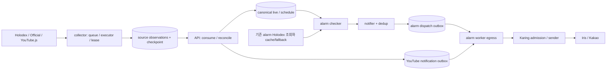

# 알람 워커·YouTube 컬렉터 구조 및 NFR 개선 기록

기준 리비전은 `48a3205bd`이며, 작업 브랜치는 `codex/alarm-collector-refactor-audit-20260911`입니다. [실행 계획](../../current/plans/2026-09-11-alarm-collector-structural-refactor.md)의 T01~T12와 코드·회귀 검사를 기준으로 작성했습니다. 운영 배포나 실제 provider SLO 달성을 증명하는 문서는 아닙니다.

## 검토 범위와 처리 흐름

| 영역 | 확인한 경계 |
| --- | --- |
| 알람 worker | composition → scheduler/checker → notifier/dedup → PG dispatch consumer → room별 egress → shutdown |
| YouTube collector | runtime/discovery/queue → provider admission → lease supervision → collect/validate → observation/checkpoint publish |
| Node helper | bootstrap/RPC → 요청별 취소 → fetch/pagination/정규화 → 응답 byte 제한 → drain/cleanup |
| 직접 연결 shared/API | alarm state·lifecycle·dispatch repository, source observation publish와 canonical schedule/live 소비 |

Collector의 observation 발행, API의 canonical 반영, worker의 발송 ledger 소유권은 유지했습니다. 알람 checker에는 현재 외부 Holodex 조회와 persisted evidence 보강이 함께 존재합니다. 아래의 조회 동등성 검토 때문에 이 경로를 canonical-only로 바꾸지 않았습니다.

## 구현 결과

| 계획 | 변경 전 문제 | 구현과 결과 |
| --- | --- | --- |
| T01 | 동일 AlarmService를 CRUD/service 두 필드에 보관하고 infra DB를 foundation에 다시 저장했습니다. scheduler constructor에는 11개 위치 인자를 넘겼습니다. | foundation은 AlarmService 하나를 소유하며 DB는 infra에서 전달합니다. module 내부 `scheduler.Dependencies`로 조립해 의존성 이름과 책임을 명시했습니다. |
| T01 | background와 egress에 named task 실행 로직이 중복됐고 subscriber가 shutdown join 대상에서 빠졌습니다. 자식 자체 deadline도 정상 종료로 소실됐습니다. | private `runNamedSchedulers`에서 기존 errgroup/panic guard를 재사용합니다. subscriber도 취소·join 대상입니다. `alarmCtx`가 살아 있을 때 자식 오류를 전달하고, 종료 deadline과 cleanup 오류를 함께 반환합니다. |
| T01 | 설정 callback이 build context의 기한을 캡처했습니다. 새 조립 경계에서 nil infrastructure를 직접 역참조할 수도 있었습니다. | callback은 build 취소와 분리하되 context 값과 기존 관리 요청 10초 한도를 유지합니다. 입력 검증은 역참조하는 builder에서 수행합니다. 현재 AlarmService가 context를 무시한다는 사실을 고려해 기존 설정 영구 실패로 과장하지 않았습니다. |
| T02 | JSON 오류·delivery context 오류·event payload 누락이 직접 DLQ로 갔지만 dedup claim은 남았습니다. | `consumer_envelope.go`가 복원·거절 처리를 소유합니다. PG worker fence와 rows-affected로 DLQ 전이가 확인된 뒤 `Record.ClaimKeys`를 기존 prefix 제한 releaser로 해제합니다. |
| T03 | 실제 sender 호출 없이 잠금 대기만 하다 timeout이 나도 SENDING/unknown으로 남았습니다. | 전송 슬롯을 BeginSending 전에 획득합니다. admission과 실제 sender/polling에 각각 기존 timeout을 적용하며 부모 기한은 유지합니다. 미발송이 증명된 admission 실패만 기존 retryable 전이를 사용합니다. |
| T03 | 초기 리팩토링에서 잠금 범위가 완료 DB 처리·audit까지 넓어지는 회귀가 리뷰에서 발견됐습니다. | BeginSending과 sender를 작은 closure의 defer 범위로 묶고, 완료/실패 DB 처리 및 audit 전에 잠금을 해제했습니다. 첫 방 완료 DB 처리가 막혀도 다음 방 sender가 진입합니다. |
| T04 | scheduler/executor에 실행 의존성을 중복 보관하고 작업마다 복사했으며 5개 forwarding wrapper와 무의미한 `_ error` 인자가 남았습니다. | scheduler가 persistent executor 하나를 소유합니다. queue/discovery/lifecycle과 attempt/collect/publish의 소유를 분리하고 중계·필드 복사·reflection 검사·무의미 인자를 제거했습니다. |
| T04 | callback 자체 deadline과 실제 join timeout을 혼동하고 fence/cancel 이후 오류 원인을 잃었습니다. classified admission 오류도 재분류됐습니다. | `(joined, error)`로 완료 여부와 오류를 분리합니다. typed 오류와 fence/cancel/deadline의 전체 원인을 보존하고 classified fatal을 supervisor에 전달합니다. |
| T04 | result invariant 실패가 nil 반환으로 attempt success처럼 집계됐고 일반 panic은 미분류 오류로 처리됐습니다. | callback 종료 뒤 invariant defer와 fatal을 한 번씩 수행하며 failed attempt를 기록합니다. 기존 panic guard와 정상 반환 여부를 사용해 실제 panic만 INTERNAL로 분류합니다. 일반 반환 오류를 자동 fatal로 바꾸지 않습니다. |
| T07 | content 페이지 전체의 upcoming metadata를 조회한 뒤 max-results/byte 예산을 적용했습니다. | native async iteration으로 행별 정규화·보강을 수행합니다. `maxResults=1`이면 metadata 조회 1회이며, byte 한도 판단에 필요한 후보 뒤의 추가 조회를 중단합니다. |
| T07 | channel snapshot을 모두 정규화한 뒤 응답 크기를 판단했습니다. | 행별 정규화 중 기존 EncodedArrayBudget으로 최종 표현의 크기 하한을 누적합니다. 확실한 초과 뒤에는 다음 원본 행과 metadata에 접근하지 않습니다. |
| T05 | helper cleanup과 lease-run cleanup의 fatal 설명이 섞여 있었습니다. | 서비스·런북에서 별도 경계로 명시했습니다. 실제 panic/명시적 INTERNAL·PROTOCOL은 fatal이고, lease join timeout 자체의 기존 비치명 정책은 유지합니다. |
| T08 | 부모 취소와 실제 scheduler 오류를 Join해 반환하면 context sentinel 검사만으로 전체 오류가 정상 종료로 소실됐습니다. | 오류 트리의 모든 말단이 context 종료일 때만 무시합니다. 혼합된 실제 원인은 오류 채널 또는 ERROR 로그로 남기고 미소비 채널의 종료 대기는 차단하지 않습니다. |
| T09 | event load 또는 배치 중간의 DLQ/키 정리 실패가 정상 delivery까지 lease 만료를 기다리게 했습니다. | 부분 발송 입력을 반환하지 않고 확정 DLQ를 제외한 claim을 기존 ReleaseLeased로 반환합니다. 최대 5초의 독립 정리 context, 원인·정리 오류 Join, attempt/send-unit/dedup 보존을 적용했습니다. |
| T10 | channel의 초기 identity 하한은 작아도 metadata 해결 뒤 실제 scheduled/LIVE/unavailable 표현이 커질 수 있었습니다. 기존 코드는 모든 player 조회가 끝난 뒤 최종 응답 크기를 검사했습니다. | metadata를 한 건씩 적용하며 실제 표현과 배열 구분 비용으로 하한을 갱신합니다. 초과 확정 뒤 후속 요청을 중단하고, 충돌 검사를 hydration 한 곳으로 모았습니다. |

주요 구현 위치는 worker의 `internal/app/workerapp`, `internal/service/workerruntime`, `internal/egress/youtubedispatch`, shared의 `pkg/applifecycle`, `pkg/service/alarm/dispatchoutbox`, collector의 `internal/runtime/collectorruntime`, `internal/runtime/joblease`, `youtubejs/src`입니다.

## 실패·부작용 계약

| 상황 | 처리 |
| --- | --- |
| malformed delivery의 terminal 전이 실패 또는 소유권 불일치 | dedup key를 해제하지 않고 오류를 반환합니다. |
| DLQ는 확정됐지만 key 해제가 실패 | 오류를 반환하며 확정된 DLQ를 되돌리거나 자동 재전송하지 않습니다. 기존 key TTL이 남을 수 있습니다. |
| 배치 복원 실패로 정상 미발송 행도 반환하지 못함 | 기존 lease/status/worker fence를 통과한 행만 즉시 반환합니다. 정리 실패는 원래 오류와 함께 보고하며, 반환에 실패한 행은 기존 lease 만료 복구 경로에 남습니다. |
| Karing slot 미획득 또는 sender 시작 전 확인된 취소 | 기존 prepared/started retryable 전이를 사용합니다. 전이가 확인되지 않으면 claim을 보존합니다. |
| provider 호출 또는 polling 뒤 timeout/결과 불명 | SENDING/unknown을 보존하며 resend·claim 해제·fallback을 추가하지 않습니다. |
| collector callback이 자체 timeout을 반환하고 종료 | callback 완료로 판정하며 해당 원인을 cancel/renew/fence 결과에 보존합니다. |
| callback이 cleanup 기한에도 미종료 | CLEANUP_TIMED_OUT을 유지합니다. 새로운 무기한 대기나 추가 supervisor는 없습니다. |
| 실제 runner panic / 일반 미분류 반환 오류 | panic은 INTERNAL/fatal, 일반 반환 오류는 기존 진단·defer 정책을 유지합니다. |

**Fallback delta: none.** 새로운 의존성·프로토콜 필드·스키마·외부 이름·retry 횟수·worker profile 설정은 추가하지 않았습니다. 방별 dedup은 기존 notifier의 exclusive SetNX claim과 정상 DLQ 정리 정책을 재사용합니다. sender 호출이 없다는 코드·테스트 증거로 admission 실패를 구분하고, 실패 배치의 claim 정리에는 기존 ReleaseLeased를 사용합니다. worker의 오류 대기·다음 drain 정책은 유지합니다.

## 동작을 유지한 근거와 남는 한계

| 항목 | 확인한 사실과 판단 |
| --- | --- |
| alarm 외부 source 제거 | canonical reader는 upcoming 30분, freshness 15분으로 제한합니다. runtime target minute 전체가 그 범위라는 계약, alarm registry와 collector projection의 coverage 일치, queue/consume 최대 지연 보장이 없습니다. row 부재·stale·미수집·조회 실패도 같은 빈 결과로 축약됩니다. 단순 전환은 알림 누락 계약을 바꿀 수 있습니다. |
| schedule 변경과 canonical-only 알람 | schedule item과 live session은 별도 persistence입니다. schedule item 변경만으로 live session의 scheduled time/freshness가 갱신된다는 경로가 없습니다. 기존 premiere/late-room guardrail과 source 병합을 유지합니다. |
| Official mixed-invalid COMPLETE | 유효 row를 보존하는 기존 회귀 테스트와 commit 근거가 있습니다. API schedule reducer는 전달된 row를 적용하고 빠진 기존 일정의 삭제 근거로 사용하지 않습니다. 같은 kind 내부의 row-level partial은 현 generic partial 계약으로 표현되지 않으므로 임의 PARTIAL 전환을 하지 않았습니다. |
| checker 부분 성공 | YouTube persisted/delivery guardrail, notifier의 Sent/Skipped/Failed와 errors.Join, scheduler의 count/error 기록이 이미 있습니다. 새 generic partial-error 계층을 추가하지 않았습니다. Chzzk 개별 조회 실패는 경고 로그와 주기적 다음 조회 정책을 유지합니다. |
| helper raw 입력 메모리 | 조기 크기 검사는 확정 행 전체와 고유 미확정 identity의 하한입니다. 제한 영상이 작은 unavailable 표현으로 축소될 수 있어 큰 제목·중복 행을 임의로 잘라내지 않습니다. youtubei.js가 이미 읽은 raw 응답과 계속 축소 가능한 중복 예정 행의 peak 메모리 전체까지 보장하지 않습니다. |
| upstream attachment shim | 기존 canary가 현재 pinned youtubei.js 결함을 확인하므로 유지합니다. dependency 변경 없이 제거할 근거가 없습니다. |
| lease cleanup 정책 | cleanup 기한 뒤 계속 실행되는 callback을 추가 추적하지 않습니다. timeout 자체를 process fatal로 바꾸는 정책 변경도 포함하지 않습니다. 해당 결과와 helper process cleanup fatal을 문서에서 구분했습니다. |
| buffered callback과 fence loss | `TestFenceLossPrefersBufferedCallbackResult`가 완료·실패 모두 callback 결과를 우선하고 release를 호출하지 않도록 고정합니다. 초기 추가 감사의 결함 후보는 이 독립 계약을 확인한 뒤 철회했습니다. fence 처리 뒤 도착한 callback의 오류 원인 보존과 구분합니다. |
| terminal commit 직후 supervisor cleanup | cancel/renew와 callback 반환이 겹치면 supervisor는 join 전에 release를 시도할 수 있습니다. release SQL의 ACTIVE/owner/fence 조건은 이미 terminal인 row의 재변경을 거부합니다. durable success/readiness와 supervision attempt는 관측 범위가 다르므로 성공 시각과 canceled/failed attempt의 공존만으로 데이터 손실을 주장하지 않습니다. 런북의 무조건적인 release 미호출 문구를 실제 계약에 맞췄습니다. |
| pagination abort와 iterator cleanup 오류 | direct iterator probe에서는 `return()` 오류가 abort보다 먼저 드러날 수 있으나 RPC의 request cancellation 분류가 408 `collection_canceled`를 유지합니다. 실제 production 오분류가 확인되지 않아 새 오류 중계 계층을 추가하지 않았습니다. |

Canonical 전환 검토의 직접 근거는 `youtube_checker_input.go`, `youtube_live_session_source.go`와 해당 SQL/테스트, API `targetprojection/schedules.go`, shared `sourceobservation/schedule_consumer.go`, live reducer입니다. 소스 이관은 동등한 read contract와 coverage/freshness 증명을 갖추는 별도 기능 변경이며, 이번 동작 보존 리팩토링의 완료와 혼동하지 않습니다.

## 검증과 NFR 측정

| 검사 | 결과 |
| --- | --- |
| 집중 회귀 | 종료 오류, subscriber join, child deadline/panic, DLQ 정리 순서와 실패, Karing admission·완료 DB 분리, collector invariant·panic·fence·deadline, helper 작업 예산을 수정 전 실패 → 수정 후 통과로 확인했습니다. |
| Karing DB/cache 통합 | task-owned 임시 PostgreSQL·Valkey에서 opt-in 전체 package race 통과. PENDING → admission 실패 → PENDING(attempt 1) → 다음 처리 SENT 및 실제 발송 1회를 확인했습니다. |
| Go package race/lint | 변경 package와 직접 소비자에서 통과했습니다. |
| 전체 local CI | 추가 감사 및 테스트 정리까지 반영한 최종 실행은 종료 0, `[LOCAL CI] Passed`. workspace Go test/race, vet/staticcheck/필수 lint/NilAway, production build/workspace·hardening·PGO·용량·성능 예산 검사 통과. opt-in 통합은 아래의 대상별 실행으로 보완했습니다. |
| alarm dispatch PG 통합 | 추가 감사 및 테스트 구조 정리 뒤 저장소의 임시 DB provision helper를 사용한 `go test -race -tags=integration ./hololive/hololive-shared/pkg/service/alarm/dispatchoutbox -count=1` 통과(15.471초). load/terminal/key 정리 실패와 다른 owner fence의 실제 재수집도 검증했습니다. |
| NilAway | 최초 전체 검사에서 조립 경계와 nil fixture 경로가 드러났습니다. 수정 후 alarm-worker·collector 전체 검사는 각각 종료 0/진단 0입니다. suppression은 추가하지 않았습니다. |
| Node helper | 추가 감사 구현 뒤 전체 166 tests, typecheck 통과. scheduled/LIVE/restricted 두 번째 metadata 응답에서 크기 초과가 확정되면 세 번째 요청이 없고, UTF-8·중복·정확한 한도에서는 성공함을 확인했습니다. |
| 아키텍처 | architecture boundary gate 통과. |
| stack 계약 | 변경 Hololive worktree를 가리킨 retry 및 worker contract gate 통과. |
| 독립 리뷰 | 선행 Karing 잠금 범위와 panic 종료 설명의 P2 두 건을 해결했습니다. 추가 감사 구현의 독립 Astra 리뷰에서도 lifecycle 혼합 오류·배치 반환 fence·hydration byte 산정에 새 actionable 결함이 없었습니다. |
| 최종 커밋 리뷰 | 원본 main에 통합한 snapshot을 alarm/shared 및 collector/Node 경계별로 독립 검토했으며 commit blocker가 없었습니다. Node 집중 66 tests와 collector/joblease 종료·오류 보존 회귀 10개의 race 검사도 추가 통과했습니다. |
| 추가 검사 중 발견한 테스트 부채 | 첫 추가 CI의 신규 코드 lint 57건은 공백·테스트 함수 분리·Done 채널 관측으로 수정했고, lifecycle/dispatchoutbox 일반 lint는 0건입니다. 별도 `golangci-lint run -c .golangci.yml --build-tags=integration ./hololive/hololive-shared/pkg/service/alarm/dispatchoutbox`는 기존 테스트 진단 460건으로 실패했습니다. 신규 두 테스트 파일 진단은 0건이며 이 추가 검사를 전체 통과로 보고하지 않습니다. |

명령은 저장소 root에서 `scripts/ci/local-ci.sh`, `go test -race`의 영향 package 패턴, `golangci-lint -c .golangci.yml`, `npm --prefix hololive/hololive-youtube-collector/youtubejs test` 및 `run typecheck`를 사용했습니다. 최초 opt-in 검사의 기본 cache 주소는 NOAUTH로 실패했습니다. 해당 주소의 인증을 추가하거나 비밀을 조회하지 않고 테스트 전용 컨테이너로 바꿔 검사를 완료했으며 컨테이너를 정리했습니다.

추가 integration lint의 기존 부채는 `repository_integration_test.go` 422건, `repository_p1_integration_test.go` 37건, 기존 `consumer_test.go:278`의 문자열 상수 진단 1건입니다. 앞 두 파일과 마지막 진단 행은 이번에 수정하지 않았습니다. 대표 항목은 `repository_integration_test.go:59`/`repository_p1_integration_test.go:103`의 cleanup 반환값 무시, `repository_integration_test.go:211`의 테스트 복잡도입니다. `repository_integration_test.go:534`의 미사용 `requireDispatchLedgerCounts`도 확인했습니다. 일반 CI는 integration-tag vet와 실제 통합 테스트를 지원하지만 이 태그의 전체 lint를 통과 기준으로 사용하지 않으므로, 해당 테스트 부채는 별도 후속 정리로 남깁니다. 검사 제외나 suppression은 추가하지 않았습니다.

PAG-014는 입력을 두 배로 늘릴 때 시간·allocation 증가율이 각각 2.5배 이내인지 검사합니다. 최종 pagination 구현의 로컬 측정은 다음과 같습니다. 이것을 운영 p95나 통계적으로 유의한 전후 성능 개선으로 해석하지 않습니다.

| items | median 집계 시간 | heap allocation |
| ---: | ---: | ---: |
| 1,000 | 0.530 ms | 592,504 B |
| 2,000 | 1.041 ms | 1,189,120 B |
| 4,000 | 2.116 ms | 2,345,104 B |

추가 감사 뒤 최종 CI의 관측 데이터 publish/consume benchmark는 9.575 ms/op, 280,319 B/op, 2,335 allocs/op였습니다. 36개 observation으로 환산한 0.345초는 저장소의 3.6초 예산 안입니다. 실제 provider 네트워크, 운영 DB/cache 부하, room별 발송 지연 또는 handoff SLO를 측정한 값은 아닙니다.

## 전달 상태

후속 사용자 지시에 따라 검증된 53개 파일을 `/home/kapu/work/iris-stack/hololive-bot`의 `main` 작업 폴더에 미커밋 통합했습니다. 적용 기준 HEAD는 `b262d3a46`이며, worktree의 `48a3205bd` 이후 추가된 classifier 커밋 19개 경로와 직접 교집합은 없습니다. 적용 전 검사, 53개 파일의 SHA-256 일치, 새 classifier 파일·HEAD/index 보존을 확인했습니다.

원본 환경에서 bot handlers, shared mekparkhost, YouTube egress, alarm dispatch와 checker의 5개 패키지 race 및 alarm-worker/collector build가 통과했습니다. Node 166 tests/typecheck, stack retry/worker와 문서 검사도 통과했습니다. 새 분류 규칙은 subscriber target key·표시명 소비 경로에서 재검증했습니다. 소스·테스트와 형제 리비전이 선행 검증과 같으므로 통합만을 이유로 전체 CI/NilAway/PG 검사를 반복하지 않았습니다.

이후 사용자가 최종 리뷰·커밋·main 합류를 승인했습니다. 검토 대상은 앞서 검증한 53개 파일과 일치하며, 이 기록을 포함하는 로컬 main 커밋을 전달 단위로 사용합니다. 실제 commit ID·부모·완료 여부는 Git ref/log에서 확인합니다. 원격 쓰기·배포는 수행하지 않았습니다.

작업 worktree `/home/kapu/work/iris-stack/.tmp/alarm-collector-refactor-audit-20260911/hololive-bot`와 `codex/alarm-collector-refactor-audit-20260911` 브랜치는 보존합니다. 형제 shared-go와 iris-client-go는 원본과 같은 clean revision을 사용하는 테스트용 detached worktree이며 소스 변경이 없습니다. 별도 integration-tag 전체 lint의 기존 테스트 부채 460건은 앞의 검증 한계대로 남아 있습니다.

실제 외부 provider smoke, 운영 부하/지연 측정, canonical-only source 전환, 신규 schema/receipt 정책은 이 로컬 변경과 검증의 결과로 대체하지 않았습니다.
