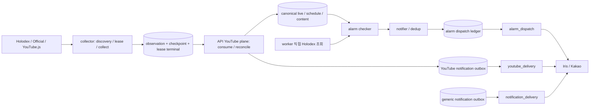

# 알람 워커·YouTube 컬렉터 상세 리뷰 및 검증 기록

> 2026-09-30의 코드 리뷰 기록입니다. 현재 운영 계약이나 구현 완료 증명이 아닙니다. 후속 작업은 [현재 작업 계획](../../current/plans/2026-09-30-alarm-worker-collector-reliability.md), 소유권은 [PROJECT_MAP](../../current/PROJECT_MAP.md)을 따릅니다.

## 수행 범위와 상태

알람 checker·notifier·세 egress 경로, collector discovery·lease·publish·YouTube.js helper, 직접 연결된 shared/API 소비 경계를 코드 수준으로 분석했습니다. 두 차례 리뷰에서 13개 문제 동작을 재현하고 수정 계획을 작성했습니다. 이 리뷰에서 제품 코드·migration·runtime 설정을 수정하지 않았으며, 커밋·원격 게시·배포를 수행하지 않았습니다.

검증은 kapu의 격리 PostgreSQL과 mock cache/sender, 제어된 실행 순서, `testing/synctest`를 사용했습니다. 운영 DB의 발생 건수, 실제 Iris/Kakao 부수효과와 운영 성능은 측정하지 않았습니다. 공유 작업 트리에 별도 live reconciliation 변경이 진행 중이므로 모든 결과를 하나의 고정된 commit snapshot에 대한 검증으로 해석하지 않습니다.

문서화 시점에는 별도 작업에서 live session SQL에 `COALESCE(title, '')`가 추가된 것을 확인했습니다. 해당 항목의 이전 실패와 최신 집중 재검증은 4번 및 검증 표에서 구분합니다. 나머지 항목의 수정 여부는 구현 착수 시 현재 코드에서 다시 확인합니다.

## 확인한 처리 흐름



| 영역 | 코드에서 확인한 책임 |
|---|---|
| collector | API projection에서 due job 조회, bounded local queue, lease 획득·갱신, provider admission, collect 결과 검증, observation publish |
| API YouTube plane | observation consume, live/schedule/content 정본 반영, notification intent, live-end finalization |
| alarm_dispatch | checker 후보 발행, 이벤트·방별 ledger, send unit 구성, 렌더링, 발송·retry·terminal |
| youtube_delivery | subscriber fanout, row_version fence, 논리 이벤트·방별 owner/ledger, 발송, 부모 aggregate·cleanup |
| notification_delivery | 범용 outbox claim, 저장된 message 발송, 상태 반영, stale sending quarantine·cleanup |

보존할 핵심은 collector의 원자적 publish입니다. [repository_publish.go](../../../hololive/hololive-shared/pkg/service/youtube/sourceobservation/repository_publish.go)의 `runPreparedPublish`는 fence 검증, observation·checkpoint 반영, lease complete/defer를 같은 transaction에 둡니다. 개선 계획은 이 경계와 YouTube logical ledger 증거를 유지합니다.

worker checker는 [youtube_checker_input.go](../../../hololive/hololive-alarm-worker/internal/service/alarm/checker/checking/youtube_checker_input.go)에서 직접 Holodex 조회와 persisted live evidence를 병합합니다. canonical-only 전환은 조회 동등성·coverage·freshness를 확인해야 하는 별도 설계 판단입니다.

## 재현한 문제

P1은 알림 누락·수신 대상 오류·request 정합성·결과 불명 처리 문제이며, P2는 복구·진행성·정리·관측 문제로 분류했습니다. 우선순위는 발생 빈도에 대한 운영 측정 결과가 아닙니다.

### 1. 일부 방의 발행이 방송 전체 dedup을 막습니다 — P1

- 코드: [notifier_publish.go](../../../hololive/hololive-alarm-worker/internal/service/alarm/checker/checking/notifier/notifier_publish.go)의 `markPublishedBestEffort`, [youtube_checker_upcoming.go](../../../hololive/hololive-alarm-worker/internal/service/alarm/checker/checking/youtube_checker_upcoming.go)의 `IsAlreadyNotifiedForSchedule` 차단입니다.
- 재현: 같은 방송·예정 시각·5분 category를 두 방에 발행하고 첫 chunk만 성공시켰습니다. 두 번째 방의 room marker는 없지만 방송 전체 marker는 완료로 조회됐습니다.
- 영향: 다음 checker 평가가 미발행 방까지 제외할 수 있습니다. 기존 부분 발행 테스트의 서로 다른 방송 ID로는 이 조건을 검증하지 못합니다.
- 수정 방향: 건별 commit receipt와 방별 발행 여부를 사용합니다. 한 방의 성공을 전체 수신 대상의 완료로 해석하지 않습니다. 계획 1단계입니다.

### 2. 미발행 upcoming 후보가 다음 평가에서 사라집니다 — P1

- 코드: [youtube_checker.go](../../../hololive/hololive-alarm-worker/internal/service/alarm/checker/checking/youtube_checker.go)의 `prepareYouTubeChannelWork`는 발행 전에 tier의 LastCheckedAt을 갱신합니다. 재선정은 제한된 evaluation window의 target crossing에 의존합니다.
- 재현: 예정 시작 4분 5초 전에 75초 lookback으로 5분 후보를 선정했습니다. notifier 성공 처리를 생략해 발행 실패를 모델링하고 65초 뒤 평가하자 후보가 0건이 됐습니다.
- 한계: 실제 PostgreSQL outage를 주입한 검사가 아니라, 선정 후 발행 성공 기록이 없는 상황을 모델링한 검사입니다. watermark 이동만으로 lookback 밖의 후보 보존을 증명할 수 없습니다.
- 수정 방향: 조회 시각과 발행 진행을 분리하고 선정된 후보를 receipt 또는 명시적 만료까지 추적합니다. 재시작 보장은 durable staging commit부터 정의합니다. 계획 2단계입니다.

### 3. 범용 발송 attempt에 handoff deadline이 없습니다 — P1

- 코드: [delivery/dispatcher.go](../../../hololive/hololive-shared/pkg/service/delivery/dispatcher.go)의 `processItem`은 장기 runtime context를 sender에 전달합니다. [iris_sender.go](../../../hololive/hololive-alarm-worker/internal/egress/iris_sender.go)의 `waitForReplyHandoff`는 context 종료까지 polling하며 조회 오류를 다시 확인합니다.
- 재현: sender가 context 종료를 기다리도록 구성했습니다. 가상 시간으로 delivery lease 두 배인 2분이 지나도 round가 종료되지 않았으며 attempt context에 deadline이 없었습니다.
- 영향: queued 상태나 status 조회 오류가 계속되면 batch join과 다음 generic claim이 막힐 수 있습니다. 실제 Iris가 이 상태로 멈추는 빈도는 확인하지 않았습니다.
- 수정 방향: 전체 handoff를 포함하는 attempt budget과 bounded 상태 반영을 추가하고, 요청 이후 timeout을 일반 미발송 실패로 취급하지 않습니다. 계획 3단계입니다.

### 4. nullable live title이 consumer scan 실패를 만듭니다 — 당시 P1, 최신 집중 검증 통과

- 이전 코드: [live_state.go](../../../hololive/hololive-shared/pkg/service/youtube/sourceobservation/live_state.go)는 title을 string으로 scan하며, 당시 live session 조회 SQL은 nullable title을 그대로 선택했습니다.
- 재현: 실제 PostgreSQL에 `title=NULL`인 metadata_only/legacy_unknown UPCOMING을 넣고 live consumer 경로를 실행했습니다. NULL을 string으로 scan하는 지점에서 실패했습니다. fixture를 빈 문자열로 바꾸는 것만으로 실제 NULL 행 문제가 해결되지는 않습니다.
- 후속 확인: 문서화 중 [복수 조회 SQL](../../../hololive/hololive-shared/pkg/service/youtube/sourceobservation/queries/repository_live_sessions_0045_45.sql)과 [단건 조회 SQL](../../../hololive/hololive-shared/pkg/service/youtube/sourceobservation/queries/repository_live_session_one_0060_60.sql)에 `COALESCE(title, '') AS title`이 추가된 것을 확인했습니다. 이번 문서화 작업이 작성한 수정은 아닙니다.
- 최신 검증 상태: 2026-09-30에 기존 NULL 진단을 최신 작업 트리에 다시 실행했습니다. metadata_only·legacy_unknown 두 subtest가 모두 통과했고 package 실행 시간은 8.938초, exit code는 0이었습니다. 이 진단은 복수 live session 조회와 consumer 반영 경로를 확인합니다. 단건 SQL은 COALESCE 추가를 코드로 확인했으며 단건 전용 진단·API plane 전체·운영 적용까지 검증한 것은 아닙니다. 계획 4단계의 통합 검증에서 해당 경계를 확인합니다.

### 5. 범용 cleanup이 빈 batch에서 생략됩니다 — P2

- 코드: [delivery/dispatcher.go](../../../hololive/hololive-shared/pkg/service/delivery/dispatcher.go)의 `processOnce`는 pending 행이 없으면 `cleanupIfDue` 전에 반환합니다. 누적 실패 집계도 같은 경로에서 생략됩니다.
- 재현: pending 결과를 비우고 cleanup이 due인 상태로 실행했습니다. cleanup 호출 수는 0회였습니다.
- 수정 방향: maintenance의 실행 주기와 새 발송 작업의 유무를 분리합니다. 별도 무기한 goroutine을 추가할 필요는 없습니다. 계획 3단계입니다.

### 6. 늦은 cache warm이 구독 해제를 덮어씁니다 — P1

- 코드: [targets.go](../../../hololive/hololive-shared/pkg/service/alarm/targets.go)의 단일 채널 DB fallback은 `cache_warm_targets.go`(후속 구현에서 제거)를 통해 subscriber set을 채웁니다. 구독 revision 검증이 없습니다.
- 재현: 실제 PostgreSQL 구독을 읽은 뒤 warm 직전에 구독 삭제와 cache 제거가 완료되는 순서를 hook으로 구성했습니다. 다음 조회에서 DB는 0건인데 해제한 방이 캐시에서 반환됐습니다. 실제 병렬 부하 검사가 아니라 가능한 실행 순서를 고정한 검사입니다.
- 근거: 같은 `targets.go`의 batch read-through는 이 SADD-after-SREM 경쟁 조건을 피하려고 positive set을 채우지 않는다고 명시합니다. [outbox_grouper.go](../../../hololive/hololive-alarm-worker/internal/egress/youtubedispatch/outbox_grouper.go)는 단일 채널 resolver를 실제 fanout에 사용합니다.
- 수정 방향: read-through가 mutation을 덮어쓰지 않게 합니다. negative empty marker와 구독 추가의 경합은 후속 검증 대상입니다. 계획 4단계입니다.

### 7. payload collision으로 거절한 delivery를 발행 성공으로 표시합니다 — P1

- 코드: [repository_insert_batch.go](../../../hololive/hololive-shared/pkg/service/alarm/dispatchoutbox/repository_insert_batch.go)는 collision 항목에 delivery를 만들지 않으며 nil error에서도 HashConflictEvents 확인을 요구합니다. [publisher.go](../../../hololive/hololive-shared/pkg/service/alarm/queue/publisher.go)와 `processedPublishBatchResult`는 입력 전체를 ProcessedDeliveries로 처리하고 notifier는 완료 마커를 기록합니다.
- 재현: 같은 방송·시점의 이벤트를 방 A에 발행한 뒤 제목만 바꿔 방 B에 발행했습니다. 실제 DB의 방 B delivery는 0건인데 notifier는 `Sent=1`, `Failed=0`, 오류 없음으로 반환했습니다. 여기서 Sent는 notifier의 발행 결과이며 실제 Kakao 전송 완료가 아닙니다.
- 원인: [dedupe_key.go](../../../hololive/hololive-shared/pkg/service/alarm/dispatchoutbox/dedupe_key.go)의 event key에는 제목이 없고 [repository_payload.go](../../../hololive/hololive-shared/pkg/service/alarm/dispatchoutbox/repository_payload.go)의 payload hash에는 제목이 포함됩니다.
- 수정 방향: 혼합 batch의 건별 receipt를 반환합니다. 제목 변경을 허용하는 snapshot 정책과 충돌 거절을 정직하게 표시하는 수정은 구분합니다. 계획 1단계입니다.

### 8. 신선도 제한을 지난 PENDING delivery에 종료 경로가 없습니다 — P2

- 코드: [transition_claim_pending.sql](../../../hololive/hololive-alarm-worker/internal/egress/youtubedispatch/store/queries/transition_claim_pending.sql)은 부모 created_at으로 claim을 제한합니다. PENDING 자식은 [aggregate 후보](../../../hololive/hololive-alarm-worker/internal/egress/youtubedispatch/store/queries/delivery_repository_0373_10.sql)를 막고, terminal cleanup과 자식 없는 outbox cleanup의 대상도 아닙니다.
- 재현: 실제 PostgreSQL의 parent/child created_at과 due 시각을 10일 전으로 설정했습니다. claim·aggregate 후보·terminal cleanup·expired fanout cleanup의 처리 결과는 모두 0건이며 PENDING 자식 2건이 남았습니다.
- 영향: 만료 행의 보관과 backlog 집계가 종료되지 않습니다. ready snapshot도 parent freshness를 확인하지 않아 claim 불가능한 행을 ready로 셀 수 있습니다.
- 수정 방향: known-unsent PENDING을 사유와 fence를 갖춘 terminal 전이로 처리한 뒤 부모 집계·retention에 연결합니다. unknown ledger나 SENDING을 나이만으로 처분하지 않습니다. 계획 5단계입니다.

### 9. 국소 후보 조회 실패가 정상 런너의 discovery를 막습니다 — P2

- 코드: [scheduler_discovery_cycle.go](../../../hololive/hololive-youtube-collector/internal/runtime/collectorruntime/scheduler_discovery_cycle.go)는 query 오류에서 cycle을 종료하고 cursor를 유지합니다. [scheduler_discovery.go](../../../hololive/hololive-youtube-collector/internal/runtime/collectorruntime/scheduler_discovery.go)도 completed cycle에서만 cursor를 갱신합니다.
- 재현: 첫 런너만 후보 query 오류를 반환하도록 4회 cycle을 실행했습니다. 정상인 다음 런너의 조회 횟수는 0회이며 cursor는 0이었습니다.
- 실제 입력 가능성: joblease의 candidate 변환은 mixed poll interval bundle을 오류로 반환합니다. 운영에 그런 bundle이 존재한다는 뜻은 아닙니다.
- 수정 방향: 전역 projection/DB 오류와 국소 runner/target 오류를 구분하고, 국소 실패의 원인을 남기면서 독립 작업의 조회와 cursor 진행을 보장합니다. 계획 6단계입니다.

### 10. 실패한 YouTube 전송을 공통 counter가 성공으로 기록합니다 — P2

- 코드: [YouTube dispatcher.go](../../../hololive/hololive-alarm-worker/internal/egress/youtubedispatch/dispatcher.go)의 `processClaimedOrPendingDeliveries`는 processed가 양수이면 AttemptSuccess를 기록합니다. [claim_manager_pipeline.go](../../../hololive/hololive-alarm-worker/internal/egress/youtubedispatch/claim_manager_pipeline.go)는 준비·전송 실패에도 claim한 행 수를 반환합니다.
- 재현: rate-limited sender와 MaxRetries=1로 실제 DB delivery를 FAILED로 만들었습니다. 공통 workercontract counter는 `Success=1`, `Failed=0`이었습니다.
- 한계: YouTube 전용 delivery 지표는 따로 있으므로 모든 지표가 성공을 보고한다는 주장은 아닙니다.
- 수정 방향: claim/준비/이미 충족된 행과 실제 provider attempt를 구분해 counter를 기록합니다. grouped provider operation과 방별 delivery의 단위도 분리합니다. 계획 7단계입니다.

### 11. 범용 delivery가 OUTCOME_UNKNOWN을 일반 실패로 재시도합니다 — P1

- 코드: [delivery/dispatcher.go](../../../hololive/hololive-shared/pkg/service/delivery/dispatcher.go)는 send error 전체를 MarkFailed로 보냅니다. [실패 SQL](../../../hololive/hololive-shared/pkg/service/delivery/queries/outbox_repository_0209_06.sql)은 횟수가 남으면 PENDING으로 바꾸고 sending 증거를 지웁니다. FAILED는 이후 enqueue로 rearm될 수 있습니다.
- 재현: SDK가 해석하는 `409 CLIENT_REQUEST_ID_OUTCOME_UNKNOWN`을 mock sender에서 반환했습니다. MarkFailed가 1회 호출됐습니다.
- 비교 근거: YouTube send engine은 같은 code를 결과 불명으로 분류해 SENDING을 보존합니다. alarm handoff 불명은 quarantine으로 처리합니다.
- 한계: 안정적인 ID가 즉시 중복을 막을 수 있으므로 실제 중복 게시를 재현한 것은 아닙니다. 확인한 문제는 확정된 결과 불명 상태를 일반 retry/FAILED 상태로 바꾼다는 점입니다.
- 수정 방향: 확정 OUTCOME_UNKNOWN·handoff 불명을 별도 전이로 보존합니다. alarm의 저장된 동일 ID·동일 request를 통한 현행 transport ambiguity retry와는 구분합니다. 계획 3단계입니다.

### 12. 확정된 pre-handoff 실패에 유한 재발급 복구가 없습니다 — P2

- 코드: [alarm_dispatch_runner_failure.go](../../../hololive/hololive-alarm-worker/internal/service/dispatchrun/alarm_dispatch_runner_failure.go)는 `409 CLIENT_REQUEST_ID_FAILED`를 별도로 처리하지 않고 quarantine으로 보냅니다.
- 재현: SDK의 `IsPreHandoffClientRequestIDConflict`가 참인 응답을 주입했습니다. quarantine이 1회 호출됐습니다.
- 근거: [로컬 Iris SDK README](../../../../iris-client-go/README.md)는 이 code에만 handoff 이전 실패와 부수효과 없음이 보장되며, 같은 payload를 새 generation으로 유한 재전송하도록 권장합니다. 현행 helper의 generation 상한은 2입니다.
- 성격: 보수적으로 종결하는 처리의 가용성 개선 항목입니다. quarantine 자체를 중복 발송 결함으로 분류하지 않습니다.
- 수정 방향: 최종 request를 먼저 고정하고 generation을 fence로 저장합니다. unknown·payload mismatch·already exists·code 없는 409에는 재발급하지 않습니다. 계획 5단계입니다.

### 13. 같은 clientRequestID의 재시도 본문이 바뀝니다 — P1

- 코드: [alarm_dispatch_runner.go](../../../hololive/hololive-alarm-worker/internal/service/dispatchrun/alarm_dispatch_runner.go)는 저장된 ID를 사용하지만 매 시도에 렌더링합니다. [template/renderer.go](../../../hololive/hololive-shared/pkg/service/template/renderer.go)는 DB의 현재 template version을 사용합니다.
- 재현: 첫 sender 호출에 timeout을 주입하고 PostgreSQL template을 변경한 뒤 retry했습니다. 두 호출의 ID는 같고 본문은 달랐습니다. 두 번째 호출에 PAYLOAD_MISMATCH를 주입하자 quarantine이 1회 발생했습니다.
- 한계: 본문 변화와 mismatch 응답 처리까지 확인했습니다. 실제 Iris 서버가 충돌을 반환하는 검사는 수행하지 않았으며 해당 의미는 SDK 계약에 근거합니다.
- 수정 방향: BeginSending 전에 send unit의 membership·최종 본문·발송 경로·ID를 영속화하고 retry/restart에서 그대로 사용합니다. 기존 미고정 in-flight 행의 과거 본문은 추정하지 않습니다. 계획 5단계입니다.

## 진단 시나리오와 실제 검증 결과

임시 overlay는 기존 test file의 복사본에 진단을 추가해 사용했으며 제품 checkout에 테스트를 추가하지 않았습니다. 아래 실패는 기존 suite 전체의 실패가 아니라, 기대하는 안전한 동작과 실제 동작의 차이를 드러낸 진단 assertion 결과입니다.

| 항목 | 진단 테스트 | 실행 환경 | 당시 결과 |
|---|---|---|---|
| 1 | TestReviewProbePartialPublishPreservesUnpublishedRoom | chunk 오류 mock | 미발행 방이 남아도 global marker=true |
| 2 | TestReviewProbeUpcomingCandidateSurvivesPublishFailure | checker·시간 입력 | 다음 평가 후보=0 |
| 3 | TestReviewProbeDeliveryAttemptHasDeadline | synctest·sender 대기 | 2분 뒤 미종료, deadline=false |
| 4 | TestReviewProbeNullableLiveTitle | 격리 PostgreSQL·consumer | 당시 NULL scan 실패; COALESCE 추가 후 두 subtest 통과 |
| 5 | TestReviewProbeCleanupRunsWithoutPendingItems | repository mock | cleanup=0 |
| 6 | TestDeepReviewReadThroughDoesNotResurrectUnsubscribedRoom | 격리 PG·cache hook | DB 구독=0, 다음 cache 조회에 방 존재 |
| 7 | TestDeepReviewPayloadCollisionIsNotPublished | 격리 PG·실제 publisher/notifier | 방 B delivery=0, Sent=1, error=nil |
| 8 | TestDeepReviewExpiredPendingDeliveryHasExit | 격리 PG·실제 SQL | 처리 경로 모두 0, pending child=2 |
| 9 | TestDeepReviewDiscoveryErrorAllowsOtherRunners | runner query mock | 4 cycle 동안 healthy query=0 |
| 10 | TestDeepReviewFailedYouTubeAttemptIsNotSuccess | 격리 PG·sender 오류 | DB FAILED, 공통 Success=1 |
| 11 | TestDeepReviewOutcomeUnknownIsNotKnownFailure | structured Iris 오류 mock | MarkFailed=1 |
| 12 | TestDeepReviewConfirmedPreHandoffFailureIsNotQuarantined | structured Iris 오류 mock | quarantine=1 |
| 13 | TestDeepReviewRetryPreservesRenderedBody | 격리 PG·timeout/mismatch mock | 같은 ID·다른 본문, quarantine=1 |

리뷰에서 수행한 기존 검증은 다음과 같습니다. 실행 시점마다 변경 중인 작업 트리가 있었으며 전체 local CI·이미지 build·publication gate의 통과를 의미하지 않습니다.

| 검사 | 확인한 결과 |
|---|---|
| 첫 리뷰의 worker·collector 패키지 테스트, shared delivery | 통과 |
| 첫 리뷰의 core package race 검사 | 대상 6개 패키지 통과 |
| 첫 리뷰의 YouTube.js 전체 테스트·typecheck | 224 tests 및 typecheck 통과 |
| 두 번째 리뷰의 dispatchrun·YouTube dispatch 하위·collectorruntime·joblease·dispatchoutbox | 기존 테스트 통과 |
| 두 번째 리뷰의 shared alarm·queue·delivery·notifier | 기존 테스트 통과 |
| 진단 overlay의 13개 시나리오 | 각 문제를 재현하는 assertion 실패 확인 |
| 문서화 시점의 NULL title 집중 재검증 | 최신 COALESCE 코드에서 metadata_only·legacy_unknown 두 subtest 통과, exit 0, package 8.938초 |

NULL title 후속 검증의 실제 명령은 다음과 같습니다. 다른 진단 시나리오나 전체 suite를 반복한 결과가 아닙니다.

```sh
env -u TEST_DATABASE_URL -u TEST_DATABASE_OWNER_TOKEN -u ALLOW_EXTERNAL_TEST_DB \
  go test -overlay /tmp/hololive-review-20260930-jyt9zxt1/overlay.json \
  -p 2 -count=1 -run '^TestReviewProbeNullableLiveTitle$' -v -timeout=90s \
  ./hololive/hololive-shared/pkg/service/youtube/sourceobservation
```

재현 명령은 저장소 루트에서 아래 형태로 사용했습니다. `/tmp` 파일이 제거되거나 원본 helper/fixture가 바뀌면 이 명령만으로 재현되지 않을 수 있습니다. 후속 구현은 테스트 이름과 위 입력·관찰을 근거로 최신 파일에 회귀 테스트를 작성합니다.

```sh
env -u TEST_DATABASE_URL -u TEST_DATABASE_OWNER_TOKEN -u ALLOW_EXTERNAL_TEST_DB \
  go test -overlay /tmp/hololive-review-20260930-jyt9zxt1/overlay.json \
  -p 2 -count=1 -run '^TestReviewProbe' -v -timeout=90s \
  ./hololive/hololive-shared/pkg/service/delivery \
  ./hololive/hololive-alarm-worker/internal/service/alarm/checker/checking \
  ./hololive/hololive-alarm-worker/internal/service/alarm/checker/checking/notifier \
  ./hololive/hololive-shared/pkg/service/youtube/sourceobservation

env -u TEST_DATABASE_URL -u TEST_DATABASE_OWNER_TOKEN -u ALLOW_EXTERNAL_TEST_DB \
  go test -overlay /tmp/hololive-review-deep-20260930-b_anf2zm/overlay.json \
  -p 2 -count=1 -run '^TestDeepReview' -v -timeout=90s \
  ./hololive/hololive-alarm-worker/internal/egress/youtubedispatch/store \
  ./hololive/hololive-youtube-collector/internal/runtime/collectorruntime \
  ./hololive/hololive-alarm-worker/internal/egress/youtubedispatch \
  ./hololive/hololive-shared/pkg/service/delivery \
  ./hololive/hololive-alarm-worker/internal/service/dispatchrun \
  ./hololive/hololive-shared/pkg/service/alarm \
  ./hololive/hololive-alarm-worker/internal/service/alarm/checker/checking/notifier
```

## 구조 검토와 보류한 주장

- videos·Shorts는 [content.go](../../../hololive/hololive-youtube-collector/internal/runtime/youtubejscollector/content.go)에서 순차 수집합니다. videos 오류면 Shorts를 시도하지 않고, videos 성공 뒤 Shorts 오류는 partial로 보존할 수 있습니다. 코드로 확인한 비대칭이며 운영 장애 빈도나 반드시 분리해야 한다는 결론은 아닙니다.
- worker `/ready`는 PostgreSQL·Valkey 가용성을 검사합니다. executor 진행성은 별도 관측 범위입니다. ready 조건 변경은 호출자와 probe 계약을 확인할 후속 설계입니다.
- YouTube post-level SENT가 새 방 전체를 막는다는 초기 의심은 결함 목록에서 제외했습니다. 현행 gate는 해당 방의 logical delivery evidence를 다시 확인하며, post tracking과 room success의 수명을 구분합니다.
- 모든 permanent FAILED revive가 결함이라는 주장은 제외했습니다. 현행 계약은 group revive를 허용합니다. 이번 계획은 unknown·만료·소진된 ID generation의 재진입을 구분합니다.
- 숫자 room ID 로그 전체가 비밀 누출이라는 주장은 하지 않았습니다. 현재 privacylog의 공개 계약을 기준으로 판단합니다.
- helper 공유 초기화의 취소·resource admission 공정성은 신뢰할 재현 또는 운영 측정이 부족해 확인된 결함으로 포함하지 않았습니다.

## 후속 작업과 완료한 산출물

완료한 작업은 코드 리뷰, 13개 진단 재현, 기존 관련 검증, [상세 작업 계획](../../current/plans/2026-09-30-alarm-worker-collector-reliability.md) 작성, 이 검증 기록의 문서화와 별도 작업에서 수정한 NULL title의 집중 재검증입니다. 제품 수정 완료로 표시할 항목은 이 작업에서 만들지 않았습니다.

후속 구현은 건별 발행 receipt·방별 dedup, 후보 보존, 범용 timeout·unknown, subscriber 정합성, request 고정·유한 reissue·만료 전이, discovery 진행, 실제 attempt 지표 순으로 진행합니다. 현재 계획의 대상 파일·회귀·완료 조건을 사용하고, 이미 다른 작업에서 해결한 항목은 재검증 근거를 기록해 중복 수정하지 않습니다.

선정 후보의 유효기간, 동일 event key의 제목 변경 처리, 기존 미고정 request의 전환은 설계 판단이 남아 있습니다. 운영 migration/backfill·배포·재시작·기존 unknown 행 처분과 원격 쓰기는 별도 승인 대상입니다. 새 gate·checker 테스트·문서 문구 강제 검사는 이 작업의 산출물이 아닙니다.
