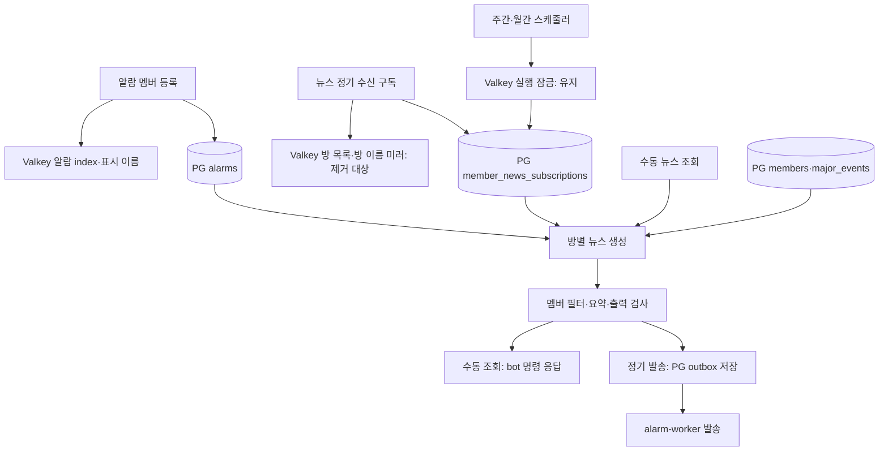

# 알람·멤버 뉴스 Valkey 의존 심층 감사

2026-09-28 HEAD `3be7229b060b`와 관련 작업 트리를 정적으로 조사했습니다. 코드·운영 데이터는 변경하지 않았고 Go 테스트, 실제 발송, 운영 설정 조회, Valkey 명령은 실행하지 않았습니다. [빅뱅 계획](../current/plans/2026-09-28-valkey-dependency-reduction.md)의 D1/D2 제거 범위는 유지합니다. 이 문서는 기존 감사의 기능 관계·장애 의미·검증 범위를 보완합니다.

## 결론

알람과 멤버 뉴스는 사용자 명령과 구독 설정이 구분되지만 **뉴스의 대상 멤버는 알람 구독에서 파생**됩니다. 뉴스의 정기 발송 대상 방은 `member_news_subscriptions`, 관심 멤버는 `alarms`와 `members`, 후보 소식은 `major_events`에서 조회합니다. 뉴스 방 미러 두 개를 지우는 것은 이 PG 조회 경로를 바꾸지 않습니다.

이번에 빠뜨리면 안 되는 유지 기능은 `membernews:lock:weekly:*`, `membernews:lock:monthly:*`입니다. 두 키는 실행 중복을 줄이는 Valkey 잠금이며 구독 방 미러와 별개입니다. LLM 사용량 추적과 실제 member provider의 epoch/L2도 계속 Valkey를 사용합니다. 이를 유지했다고 해서 모든 항목이 영구적으로 Valkey에 있어야 한다고 판정한 것은 아닙니다.

## 실제 흐름

스케줄러의 `Sent` 집계는 outbox `Enqueue` 성공을 뜻합니다. 사용자가 메시지를 받았다는 증거는 worker의 발송 결과에서 확인해야 합니다. 코드 기본 일정은 주간 월요일 09:00 KST, 월간 1일 10:00 KST입니다. 현재 운영 활성 여부·설정은 조사하지 않았습니다.

## N01 높은 우선순위 — 구독 두 종류와 수동 조회를 분리해 검증

근거: [방별 멤버 SQL](../../hololive/hololive-api/internal/planes/llm/internal/service/membernews/queries/repository_query_0080_03.sql), [뉴스 service](../../hololive/hololive-api/internal/planes/llm/internal/service/membernews/service.go), [수동 명령](../../hololive/hololive-api/internal/planes/bot/internal/command/handlers/news/news_member_news.go), [정기 대상 수집](../../hololive/hololive-api/internal/planes/llm/internal/service/membernews/scheduler/digest_helper.go).

- 뉴스 구독은 방을 정기 수신 대상으로 등록합니다. 별도의 뉴스용 멤버 목록을 만들지 않습니다.
- 관심 멤버 SQL은 해당 방의 모든 `alarms` 행에서 이름을 얻습니다. `LIVE`만 선택하는 조건이 없으므로 알람 타입을 새로 제한하면 기능 변경입니다.
- 이름은 `alarms.member_name → members.korean_name → english_name → japanese_name`의 첫 빈 문자열이 아닌 값입니다. `DISTINCT`는 channel ID가 아닌 이름에 적용됩니다. `alarm:member_names`와 `hololive:members`는 이 SQL의 입력이 아닙니다.
- 명령 handler와 `GenerateRoomDigest`는 정기 뉴스 구독 여부를 먼저 검사하지 않습니다. 정상 접근 제어를 통과한 수동 조회에 뉴스 구독 필수 조건을 추가하지 않습니다.
- 알람 멤버가 없으면 `ErrNoSubscribedMembers`입니다. 정기 발송은 해당 방을 skip하고 수동 명령은 안내합니다. 후보 소식만 없으면 빈 digest이며, 정기 경로는 빈 소식 안내를 enqueue할 수 있습니다.

검증 표:

| 뉴스 정기 구독 | 알람 멤버 | 수동 조회의 데이터 조건 | 정기 실행의 대상 |
|---|---|---|---|
| 없음 | 있음 | 멤버 기반 생성 가능 | 대상 방에서 제외 |
| 있음 | 있음 | 멤버 기반 생성 가능 | 요약 후 enqueue |
| 있음 | 없음 | 멤버 없음 오류/안내 | 방을 수집한 뒤 skip |
| 없음 | 없음 | 멤버 없음 오류/안내 | 대상 방에서 제외 |

이는 데이터 분기 설명이며 HTTP 인증·기존 명령 접근 제어를 우회한다는 의미가 아닙니다.

## N02 높은 우선순위 — 제거 가능한 미러의 근거와 절감 범위

근거: [repository 조회](../../hololive/hololive-api/internal/planes/llm/internal/service/membernews/repository_query.go), [변경](../../hololive/hololive-api/internal/planes/llm/internal/service/membernews/repository_mutation.go), [cache 쓰기](../../hololive/hololive-api/internal/planes/llm/internal/service/membernews/repository_cache.go).

현재 `IsSubscribed`, `ListSubscribedRooms`, `GetRoomMembers`, `ListActiveMajorEvents`는 모두 PG를 조회합니다. `hololive`, `scripts`, `deploy`의 literal·상수 참조를 확인했으며 두 방 미러의 runtime reader는 찾지 못했습니다. repository의 쓰기·초기화 및 개인정보 마스킹 참조가 확인됐습니다. 외부 설치 스크립트까지 부재가 증명된 것은 아닙니다.

구독은 PG UPSERT 뒤 `SADD`와 `HSET`, 해지는 PG DELETE 뒤 `SREM`과 `HDEL`을 시도합니다. Valkey 오류는 경고이며 PG 성공을 취소하지 않습니다. 초기화는 PG 목록 조회 후 두 키 삭제와 비어 있지 않으면 set/hash 적재를 수행합니다.

따라서 D1은 정상 구독·해지마다 대상 Valkey 명령 2개, 초기화마다 2~4개의 명령을 없앱니다. 이미 PG에서 읽으므로 대체 캐시나 새 PG 조회를 추가할 이유가 없습니다. latency·메모리 절감의 운영 수치는 측정하지 않았습니다.

## N03 높은 우선순위 — 뉴스 실행 잠금과 알람 사전 claim의 실패 의미가 반대

근거: [주간 scheduler](../../hololive/hololive-api/internal/planes/llm/internal/service/membernews/scheduler/scheduler.go), [월간 scheduler](../../hololive/hololive-api/internal/planes/llm/internal/service/membernews/scheduler/monthly_scheduler.go), [DigestScheduler](../../hololive/hololive-api/internal/planes/llm/internal/schedulerkit/digest_scheduler.go), [delivery locker](../../hololive/hololive-shared/pkg/service/delivery/locker.go), [알람 claim](../../hololive/hololive-shared/pkg/service/alarm/dedup/service.go), [notifier 준비](../../hololive/hololive-alarm-worker/internal/service/alarm/checker/checking/notifier/notifier_resolve.go).

| 항목 | 정상 경쟁 | Valkey 오류 | 역할 |
|---|---|---|---|
| 뉴스 `membernews:lock:weekly:*`·`monthly:*` | 이미 잠겼으면 실행 skip | acquired=true로 계속 실행 | 같은 기간의 동시 요약 작업 억제 |
| 알람 `notified:claim:*` 계열의 사전 claim | 확보하지 못하면 해당 준비 건 skip | false로 반환해 해당 준비 건 skip | PG publish 전 중복 준비 억제 |

뉴스 잠금 TTL은 현재 15분이며 token 비교로 해제합니다. 완료 뒤 잠금은 제거되고 TTL 연장 경로는 확인되지 않습니다. 따라서 기간 전체를 한 번만 실행시키거나 임의로 긴 LLM 작업의 단독 실행을 보장하는 장치는 아닙니다. 정상 잠금도 이미 수행된 LLM 비용을 영속적으로 중복 제거하지 않습니다.

잠금 제거·항상 nil 주입은 정상 상황의 동시 생성까지 허용합니다. `NewLocker(nil)`의 기존 no-op이 있다는 이유로 이를 새 정상 경로로 채택하지 않습니다. 기존 fail-open 동작의 강화·삭제는 이번 미러 fadeout과 분리합니다. 반대로 알람 사전 claim 오류 시 publish까지 도달하지 않는 경로가 있으므로, PG ledger가 존재한다는 이유만으로 신규 알람 생성도 Valkey 장애와 무관하다고 주장하지 않습니다.

## N04 높은 우선순위 — 뉴스의 PG 발송 경로는 설정별로 확인

근거: [DeliveryModule](../../hololive/hololive-api/internal/planes/llm/runtime/delivery_module.go), [outbox repository](../../hololive/hololive-shared/pkg/service/delivery/outbox_repository.go), [handoff](../../hololive/hololive-shared/pkg/service/delivery/outbox_repository_handoff.go), [dispatch 변환](../../hololive/hololive-api/internal/planes/llm/runtime/delivery_dispatch_handoff.go), [digest identity](../../hololive/hololive-shared/pkg/domain/alarm_dispatch_source.go).

| `DELIVERY_OUTBOX_V3_HANDOFF_MODE` | enqueue 경로 | 수용 시 확인 |
|---|---|---|
| `off` | `notification_delivery_outbox` | 기존 notification delivery executor와 backlog |
| `shadow` | 기존 outbox + dispatch의 관측 행 | 관측 행이 실제 발송으로 claim되지 않음 |
| `cutover` | `alarm_dispatch_events`·`alarm_dispatch_deliveries` | dispatch executor, 이전 outbox 잔여 backlog |

소스와 Compose의 기본은 `off`입니다. 실제 운영값은 읽지 않았으므로 현재 뉴스가 어느 경로로 발송 중인지 확정하지 않습니다. 기존 전환 기능의 제거·기본값 변경은 D1/D2에 포함하지 않습니다. 빅뱅 cutover의 drain과 rollback에는 실제 사용 경로 및 잔여 양쪽 backlog를 포함합니다.

기존 outbox의 identity는 `kind`와 `period:room`이며 SQL은 기존 `FAILED`만 재설정합니다. dispatch digest는 kind·기간에 더해 렌더링 메시지 hash가 identity에 포함됩니다. 같은 기간·방이라도 본문이 달라지면 dispatch identity가 달라질 수 있습니다. 따라서 “PG가 있으니 뉴스 실행 잠금 없이도 같은 기간에 항상 한 번만 발송”이라는 보장은 성립하지 않습니다. 이것은 정적 경로에서 도출한 위험이며 실제 중복 발송을 관측했다는 주장은 아닙니다.

## N05 높은 우선순위 — 알람 mutation은 뉴스 미러와 같은 실패 처리가 아님

근거: [알람 추가](../../hololive/hololive-shared/pkg/service/notification/alarmservice/alarm_service_add.go), [PG 저장·cache 복구](../../hololive/hololive-shared/pkg/service/notification/alarmservice/alarm_persistence.go), [cache 쓰기](../../hololive/hololive-shared/pkg/service/notification/alarmservice/alarm_service_cache_write.go), [durability 테스트](../../hololive/hololive-shared/pkg/service/notification/alarmservice/alarm_service_durability_test.go).

알람 추가는 PG 저장 후 방별 set, channel subscriber index, 표시 이름, registry/version을 갱신합니다. cache 오류 시 PG에서 재구성을 시도하고 원래 mutation 오류를 반환합니다. 재구성이 성공해도 반환 오류가 남을 수 있으며 PG 저장을 자동 rollback하지 않습니다. “요청 오류 = PG 변경 없음”으로 해석하면 안 됩니다.

뉴스 미러는 같은 상황에서 경고 후 성공을 반환합니다. 따라서 두 repository에서 cache 관련 코드만 같은 패턴으로 삭제하면 서로 다른 성공·실패 의미를 바꾸게 됩니다. D1 성공 계약을 알람 전체로 일반화하지 않고 기존 durability 회귀를 유지합니다.

알람 subscriber 조회는 유효한 cache hit를 사용하고, miss/error 시 DB가 있으면 PG 조회와 warmup을 합니다. known-empty marker와 singleflight도 있습니다. [targets.go](../../hololive/hololive-shared/pkg/service/alarm/targets.go)의 DB fallback이 모든 알람 cache 사용에 적용되는 것은 아닙니다. cache-only lookup과 이름 batch 조회는 별도입니다.

## N06 높은 우선순위 — 알람 이름은 여러 reader와 서로 다른 producer가 사용

근거: [alarmcache state](../../hololive/hololive-shared/internal/service/notification/alarmcache/state_member.go), [PG warmup 이름 구성](../../hololive/hololive-shared/pkg/service/alarm/cache_warm_data.go), [worker batch 조회](../../hololive/hololive-alarm-worker/internal/service/alarm/checker/checking/common.go), [YouTube formatter](../../hololive/hololive-shared/pkg/service/youtube/outbox/format/formatter.go), [matcher fallback](../../hololive/hololive-api/internal/planes/bot/internal/service/matcher/matcher_candidate.go).

`alarm:member_names`는 channel ID→알림 표시 이름입니다. 알람 등록 시에는 provider의 `ShortKoreanName → NameKo → Name`, 없으면 요청 이름을 사용합니다. PG 전체 warmup은 host별 구독을 제외한 `alarms.member_name`을 구성에 사용합니다. producer가 하나라고 가정할 수 없으며 이름이 항상 최신 member master와 같다는 보장도 없습니다.

reader는 알람 checker의 batch 이름 보강, 알람 조회, YouTube 알림 formatter, matcher의 외부 조회 실패 시 이름 보완입니다. 뉴스의 관심 멤버 SQL이나 제거 대상 `hololive:members`의 조직/이름 index와는 다른 계약입니다. 단순히 provider로 치환하면 한국어 단축명·구독 당시 이름·fallback·batch 비용이 달라질 수 있습니다.

현재 패치에서는 유지합니다. 후속 제거 후보로 재평가하려면 모든 reader를 같은 명세로 옮기고, cold/warm 상태·동일 channel 복수 멤버·이름 변경·provider 실패·host 구독을 함께 검증해야 합니다. provider의 오류를 정상 빈 이름으로 바꾸는 방식은 허용하지 않습니다.

## N07 중간 우선순위 — 사용량 관측과 wakeup을 필수 영속 상태로 설명하지 않음

근거: [LLM usage counter](../../hololive/hololive-api/internal/planes/llm/internal/llm/cost_ceiling.go), [뉴스 bootstrap](../../hololive/hololive-api/internal/planes/llm/runtime/bootstrap_alarm.go), [PG publish 뒤 wakeup](../../hololive/hololive-shared/pkg/service/alarm/queue/publisher.go), [worker idle](../../hololive/hololive-alarm-worker/internal/service/dispatchrun/alarm_dispatch_idle.go).

`llm:cost:tokens:YYYY-MM`은 월간 토큰 누계와 임계 초과 경고입니다. 초과 시 LLM 호출을 차단하지 않으며 Valkey 오류도 응답 오류로 전파하지 않습니다. cache=nil 또는 ceiling<=0이면 비활성입니다. 엄격한 지출 상한으로 설명하지 않습니다. 현재 활성 설정을 보존하고 별도 목적 없이 없애지 않습니다.

`alarm:dispatch:wakeup`은 PG insert 뒤 payload 없는 신호를 보내고 worker가 빨리 깨어나게 합니다. 손실·오류 시 PG polling 경로가 있습니다. 영속 delivery를 대신하지 않으므로 장기적으로 제거 가능한 성능 의존 후보이지만, polling 지연·빈 poll 수·PG 부하를 측정해야 합니다. 이번에는 기존 기능을 유지합니다.

`BuildLLMSchedulerRuntime`은 공용 Valkey resources와 readiness를 계속 요구합니다. 방 미러 제거 뒤에도 뉴스 전체나 API 전체가 Valkey 없이 시작한다고 보장하지 않습니다.

## N08 중간 우선순위 — 기존 테스트가 SQL 의미를 충분히 입증하지 않음

근거: [repository fake](../../hololive/hololive-api/internal/planes/llm/internal/service/membernews/repository_test.go), [PG adapter test](../../hololive/hololive-api/internal/planes/llm/internal/service/membernews/repository_pgx_test.go), [구독 SQL](../../hololive/hololive-api/internal/planes/llm/internal/service/membernews/queries/repository_mutation_0033_01.sql).

확인한 repository fake의 Query는 `member_news_subscriptions` 조회만 구현합니다. `GetRoomMembers`의 alarms/members join을 검증하지 않습니다. `repository_pgx_test.go`는 nil adapter/row 경계이며 실제 PG join을 실행하는 증거가 아닙니다. 해당 package와 dbtest 검색 범위에서 그 SQL을 직접 검증하는 테스트를 찾지 못했습니다.

또한 fake는 빈/공백 roomName 재구독 시 기존 이름을 보존하지만 실제 SQL의 `COALESCE(EXCLUDED.room_name, ...)`는 빈 문자열을 NULL로 바꾸지 않습니다. non-null 빈 문자열이면 덮어쓰는 차이가 있습니다. 이번 패치에서 SQL 의미를 임의로 바꾸지 않고, 구현 검증 시 fake를 실제 계약에 맞추고 빈 문자열·재구독을 격리 PG로 확인합니다.

미러 삭제 검증에 `cache=nil`만 사용하면 뉴스 잠금·cost tracker·member epoch 연결까지 끊어 놓고 통과할 수 있습니다. 두 폐기 키만 거부하는 spy와 필요한 Valkey capability의 정상 호출 검증을 함께 사용합니다. 수동 조회·정기 구독·관심 멤버의 관계, 실제 enqueue 이후 worker 결과를 별도 증거로 둡니다.

## N09 중간 우선순위 — 해지와 이미 enqueue된 뉴스의 경계를 보존

근거: [해지 SQL](../../hololive/hololive-api/internal/planes/llm/internal/service/membernews/queries/repository_mutation_0054_02.sql), [정기 발송 helper](../../hololive/hololive-api/internal/planes/llm/internal/service/membernews/scheduler/digest_helper.go), [delivery dispatcher](../../hololive/hololive-shared/pkg/service/delivery/dispatcher.go).

해지는 `member_news_subscriptions` 행을 삭제하며 알람 멤버나 이미 생성한 outbox를 지우지 않습니다. 스케줄러가 수집한 방 목록과 이미 저장한 메시지도 해지 시점에 함께 취소되지 않습니다. 확인한 기존 delivery dispatcher는 저장된 room/message를 발송하며 뉴스 구독을 재조회하지 않습니다.

따라서 미러 제거의 수용 조건을 “해지 직후 이미 생성한 뉴스도 모두 취소”로 추가하면 기능 변경입니다. 이번에는 다음 대상 수집에서 제외되는 기존 계약을 보존합니다. 기존 backlog의 취소 semantics를 바꾸려면 별도 요구·설계가 필요합니다. 운영 해지 후 실제 발송 사례를 관측한 것은 아닙니다.

## 유지 필요성의 구분

| 항목 | 현재 판단 | 향후 제거에 필요한 근거 |
|---|---|---|
| 뉴스 방 미러 2개 | 이번 D1에서 완전 제거 | 외부 consumer 부재 확인, 기존 PG 의미·대상 key I/O 0 검증 |
| `hololive:members` | 기존 D2에서 완전 제거 | 기존 전체 reader/writer/API 제거 명세 충족 |
| 뉴스 실행 잠금 | 현재 동시 생성 억제 계약을 위해 유지 | 생성 비용·중복 identity·동시 실행 대책 검증 |
| 알람 사전 claim | 현재 publish 준비 결과를 좌우하므로 유지 | 모든 분기와 장애 시 PG 도달·중복 의미 재설계 |
| 알람 subscriber index | 재구성 가능한 조회 가속 계층, 현재 유지 | 모든 reader 전환·DB QPS/지연·invalidation 검증 |
| 알람 표시 이름 | 현재 표시 결과를 보존하려고 유지 | 이름 대표·한국어·fallback·batch 계약 통일 |
| dispatch wakeup | latency 최적화, 현재 유지 | polling 지연과 DB 부하 측정 |
| 월간 토큰 누계 | 공유 관측 기능, 현재 유지 | 관측 포기 또는 동등한 기존 집계 수단 확정 |
| 뉴스/알람 PG outbox | 영속 상태와 발송 소유권을 위해 보존 | 이번 Valkey 축소 범위 밖 |

“현재 유지”는 모든 항목이 Valkey에 영구적으로 종속돼야 한다는 뜻이 아닙니다. 이번 한 패치에서 종료 상태를 검증할 수 있는 중복 기능과, 별도의 의미·성능 검증이 필요한 기능을 구분한 판단입니다.

## 계획 반영과 검증 한계

계획 K 집합에 뉴스 실행 잠금을 명시하고, B19~B27에 구독 조합·alarms SQL·잠금 실패 차이·양쪽 outbox·이름 producer·usage 관측·해지/backlog 회귀를 추가합니다. 폐기 키 정리에서 `membernews:*` 전체 삭제를 금지합니다. C0/C2는 실제 delivery handoff와 executor/profile·양쪽 backlog 확인을 포함합니다.

기존 D1/D2 제거 범위와 단일 patch 조건은 그대로입니다. delivery handoff 전환, 잠금 fail-open 강화, 이름 정규화의 확대, 이미 enqueue된 메시지 취소를 묶어서 구현하지 않습니다. 검증 명세 추가는 해당 기능들을 보존하기 위한 것입니다.

이번 증거는 코드·SQL·테스트의 정적 분석입니다. 현재 운영 설정·키 개수/크기·QPS·LLM 실행 시간·실제 중복 또는 누락 사례는 미확인입니다. 새 회귀 테스트 구현·실행과 운영 수용 완료를 주장하지 않습니다.
