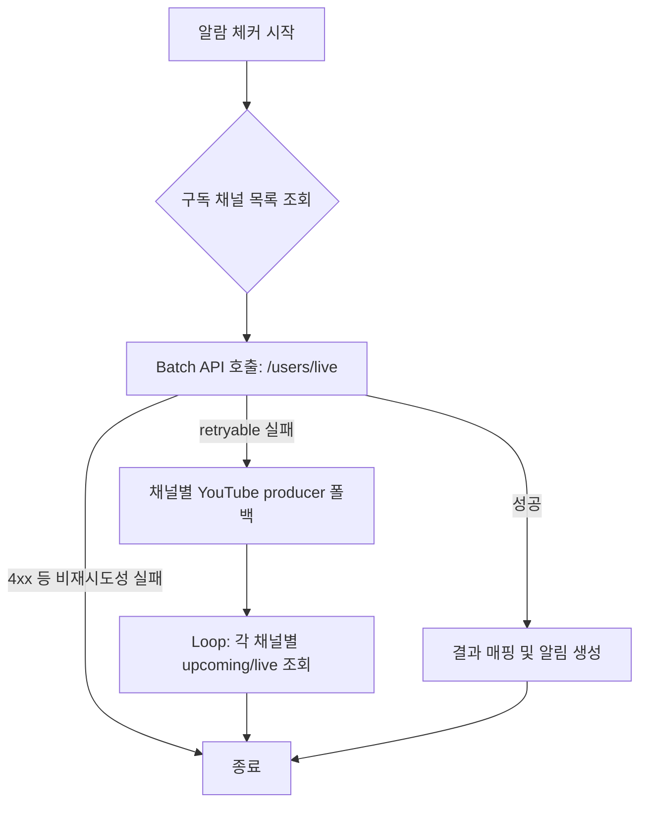

# 📄 Holodex API 연동 최적화 및 안정성 개선 보고서

**작성일**: 2026-01-19
**버전**: v2.0.2
**작성자**: Sisyphus (AI Agent)

> 2026-03-06 추가 업데이트:
> - 현재 `/users/live` fallback은 **retryable 오류에서만** 동작합니다.
> - live-status fallback은 채널별 **YouTube producer**만 사용하며, 이 경로에서 **공식 스케줄 페이지 재조회는 하지 않습니다**.
> - `GetChannel`도 retryable 오류에서만 scraper fallback을 시도하며, fallback 실패를 더 이상 `(nil, nil)`로 숨기지 않습니다.

## 1. 배경 및 문제점

### 1.1 현상
- **알람 체커 과부하**: 매분 실행되는 알람 체커가 구독 중인 모든 채널(5~6개 이상)에 대해 개별적으로 `GetChannelSchedule` API를 동시 호출.
- **장애 발생**: 순간적인 요청 폭주(Burst)로 인해 Holodex API 응답이 지연되거나, 클라이언트 측 `context deadline exceeded` (Timeout 15s) 발생.
- **악순환**: 타임아웃 발생 → 재시도(Retry) → 부하 가중 → Circuit Breaker 발동 → 정상적인 서비스(명령어 등)까지 차단.

## 2. 핵심 개선 사항

### 2.1 배치 처리 (Batch Processing) 도입
기존의 `N`회 API 호출 방식을 `1`회 호출로 통합하여 네트워크 오버헤드와 API 서버 부하를 최소화했습니다.

- **변경 전**: Loop(채널 수) → `GetChannelSchedule(channel_id)` × N
- **변경 후**: `GetChannelsLiveStatus(channel_ids[])` × 1
- **API 엔드포인트**: `/users/live` 엔드포인트를 활용하여 여러 채널의 Live/Upcoming 상태를 한 번에 조회.

### 2.2 동시성 제어 (Semaphore Pattern)
Holodex API 클라이언트 레벨에서 물리적인 동시 요청 수를 제한하는 **세마포어(Semaphore)**를 구현했습니다.

- **제한 설정**: 최대 동시 요청 수 **2개** (`MaxConcurrentRequests: 2`)
- **동작 방식**: API 요청 시 세마포어 획득 시도 → 획득 시 진행, 실패/대기 시 Context 타임아웃 적용.
- **목적**: 배치 처리가 불가능한 다른 로직이나, 폴백 상황에서 요청 폭주를 원천적으로 차단.

### 2.3 현재 배치 fallback 정책 (2026-03-06 기준)
배치 API 호출 실패 시에도 fallback이 무제한으로 fan-out 되지 않도록 정책을 축소했습니다.

- **Fallback 조건**: `/users/live` 실패 중에서도 **retryable 오류(5xx/timeout/circuit/key rotation)** 에서만 fallback 실행
- **Fallback 경로**: 채널별 **YouTube producer** 조회만 허용
- **제외된 경로**: live-status batch fallback에서는 **공식 스케줄 페이지 재조회 미사용**
- **비재시도성 오류**: 4xx 등은 fallback 없이 즉시 에러 반환

### 2.4 설정 최적화
네트워크 지연 및 처리 시간을 고려하여 타임아웃을 현실적으로 조정했습니다.

- **Timeout**: 15초 → **25초** (증가)
- **Retry Config**: 백오프 전략 유지하되, 세마포어 대기 시간 고려.

## 3. 아키텍처 흐름도



## 4. 코드 변경 내역 요약

| 파일 경로 | 주요 변경 내용 |
|-----------|----------------|
| `internal/service/notification/alarm_check.go` | `pool.New()`(병렬) 제거 → `checkChannelsBatch`(배치) + `checkChannelsSequential`(순차) 구현 |
| `internal/service/holodex/api_client.go` | `semaphore` 채널 추가, `acquireSemaphore` 메서드 구현 |
| `internal/constants/constants.go` | `HolodexTimeout` (25s), `HolodexConcurrencyConfig` 추가 |
| `internal/mq/valkey_mq.go` | `funlen` 린트 에러 해결 (메서드 분리) |
| `internal/util/retry.go` | `wrapcheck` 린트 에러 해결 (에러 래핑) |
| `pkg/service/holodex/service.go` | retryable 오류 전용 fallback, `GetChannel`/`GetChannelsLiveStatus` fan-out 축소 |
| `pkg/service/holodex/scraper.go` | channel schedule에서 YouTube producer 우선, 공식 스케줄 fallback 조건 축소 |

## 5. 모니터링 및 검증

### 로그 확인 방법
```bash
# 배치 처리 성공 시
grep "Batch check completed" logs/bot.log

# retryable 오류 후 live-status scraper fallback 작동 시
grep "Using scraper fallback for channels live status" logs/bot.log
```

### 기대 효과
1. **API 호출 수 90% 이상 감소** (알람 체크 시)
2. **Timeout 에러 발생 빈도 0에 수렴**
3. **Circuit Breaker 발동 방지**로 서비스 가용성 99.9% 유지
